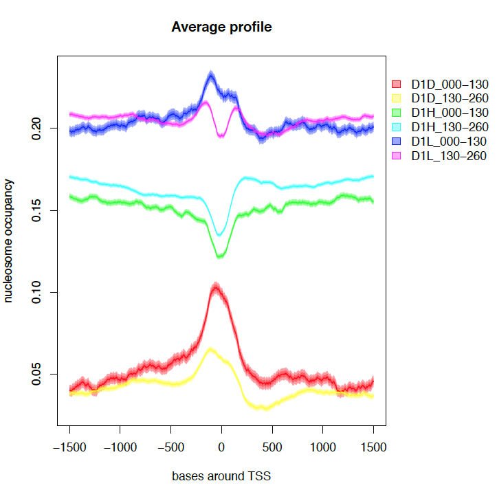
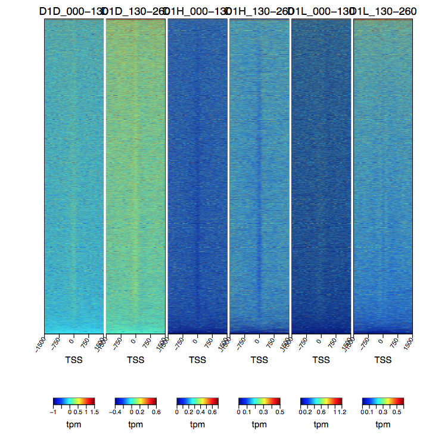
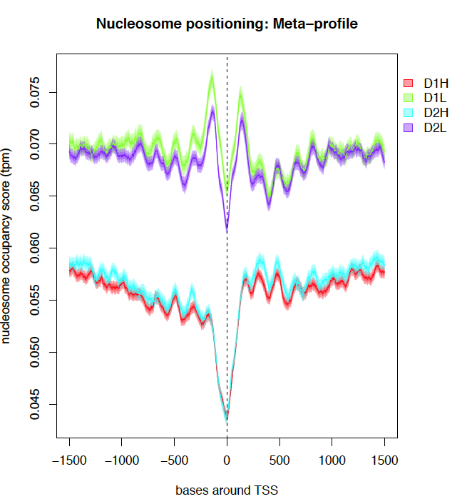
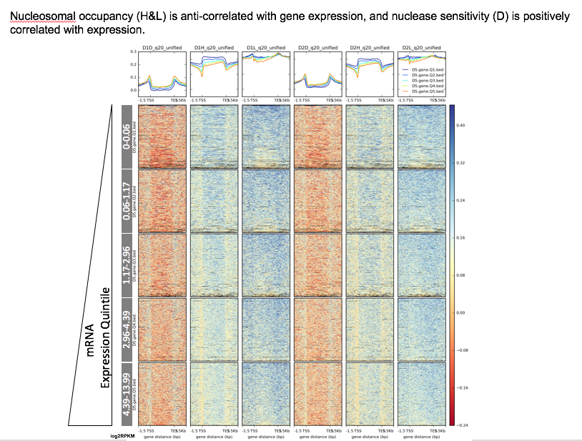
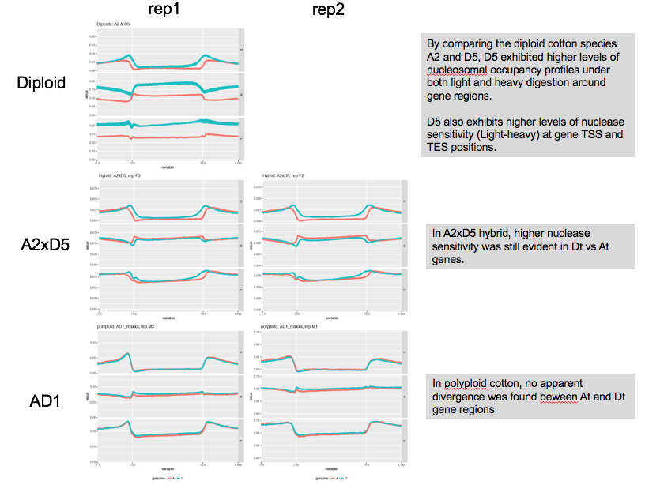

# Preliminary results

## Heatmap and plot of meta-profiles of nucleosome occupancy scores around TSS

### From differential nuclease sensitivity profiling dataset
Take one biological replication of D-genome sample (D1) for example, nucleosome occupancy scores of Light (D1L) and heavy (D1H) digestion and their differences (D1D) were examined at 3kb surrounding 37223 TSSs annotated in reference D genome. MNase-seq fragments were partitioned into two size ranges, 0-130bp and 130-260bp.

A nucleosome "free" region was clearly shown in D1H and the 130-260bp fragments of D1L at TSS surrounded by -1 and +1 nucleosomes, as consistent with Mieczkowski et al (2016). For the sub-monomuclesomal size range of D1L, -1 and +1 nucleosomes appeared to be fused without an apparant "free" region.

The difference values of light and heavy digestions (D1D) exhibited a MSF signature around TSS in both size ranges.

### From nucleosme calling dataset

Next I plotted the nucleosome occupancy scores generated drom nucleoR analysis, which was processed to remove noise and amplify nucleome signals. The meta profile below showed clear nucleosome "free" region at TSS, flanked by well aranged nucleosome peaks.

### Nucleosomal occupancy profiles and nuclease sensitivity are associated with gene expression
Analyses based on all sequences without size partition.

### Divergence between diploids and between sub-genomes in allopolyploid cotton
Analyses based on all sequences without size partition.
